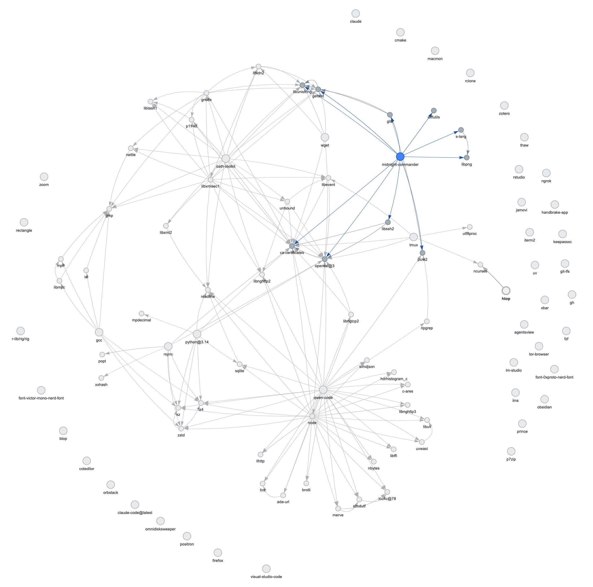

# brewgraph

Inspect installed Homebrew packages and draw their dependency graph as an
interactive HTML page.



## Usage

```sh
python3 brewgraph.py            # generates brew-deps.html and opens it
python3 brewgraph.py --no-open  # just generate the file
python3 brewgraph.py --no-casks # formulae only, exclude casks
```

See [brew-deps.html](brew-deps.html) for a generated example (download and
open locally — GitHub doesn't render HTML in the repo view).

No dependencies beyond Python 3 and Homebrew itself.

## How it works

The script runs `brew deps --installed` (one fast call covering formulae and
casks), parses the `package: dep dep…` output, and writes a self-contained
HTML page that renders the graph with [vis-network](https://visjs.github.io/vis-network/)
loaded from a CDN — nothing to install, which makes HTML the easiest route
over SVG/Graphviz.

## Reading the graph

- **Blue nodes** are top-level packages (nothing depends on them — what you
  likely installed yourself); **grey nodes** are pulled-in dependencies, with
  arrows pointing from package to dependency.
- Pan, zoom, and drag nodes; **clicking a node** dims everything except it
  and its direct neighbours. Click empty space to reset.

## Note on restricted environments

The script redirects Homebrew's cache to `/tmp/brewgraph-cache` and disables
bootsnap, so it also works in sandboxed environments where brew cannot write
to `~/Library/Caches/Homebrew`. This is harmless on a normal setup.
